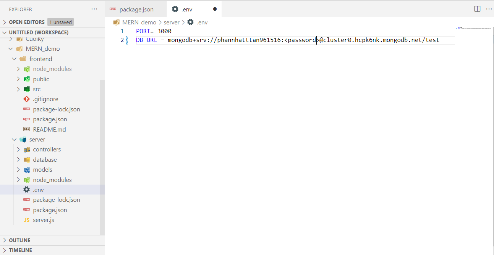
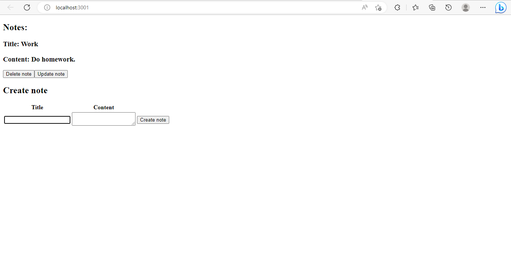
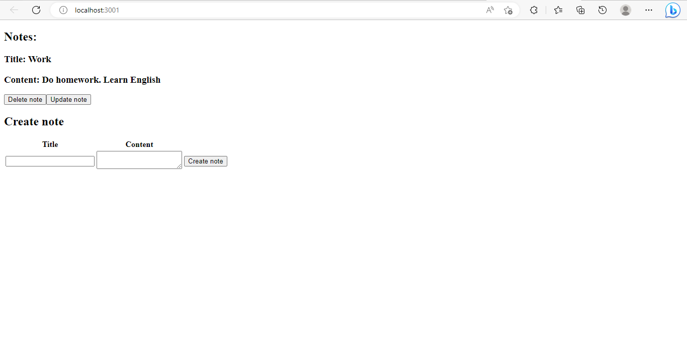
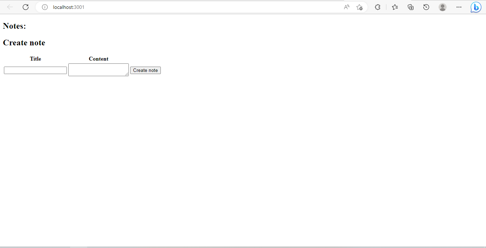

<h1> MERN DEMO </h1>
<!-- TABLE OF CONTENTS -->
<details>
  <summary>Table of Contents</summary>
  <ol>
    <li>
      <a href="#about-the-project">About The Project</a>
      <ul>
        <li><a href="#built-with">Built With</a></li>
      </ul>
    </li>
    <li>
      <a href="#getting-started">Getting Started</a>
      <ul>
        <li><a href="#prerequisites">Prerequisites</a></li>
        <li><a href="#installation">Installation</a></li>
      </ul>
    </li>
    <li><a href="#usage">Usage</a></li>
    <li><a href="#contact">Contact</a></li>
    <li><a href="#acknowledgments">Acknowledgments</a></li>
  </ol>
</details>

<!-- ABOUT THE PROJECT -->
## About The Project

 <br>
This is a basic example of MERN stack. This example can help you understand how to create MERN stack applications and how it works. <br>
<hr>

### Built With

The technologies that I use in this project include:
* [![React][React.js]][React-url]
* <a href="https://expressjs.com/">  </a>
* <a href="https://nodejs.org/en">  </a>
* <a href="https://www.mongodb.com/">  </a>

<!-- GETTING STARTED -->
## Getting Started

### Prerequisites
To be able to run this application, you need to install:
* npm
  ```sh
  npm install npm@latest -g
  ```
### Installation
To installing and setting up the application, please follow these steps:
1. Clone the repo
   ```sh
   git clone https://github.com/PhanNhatTanPK/MERN_demo.git
   ```
3. Install NPM packages
   ```sh
   npm install
   ```
4. Connect database <br>
  Access the <a href="https://www.mongodb.com/">MongoDB</a> website and create a database,  then click on the 'Connect' button, select 'Connect Using VS Code', copy and paste the connection string into the .env file in the server folder.
  
<p align="right">(<a href="#readme-top">back to top</a>)</p>

<!-- USAGE EXAMPLES -->
## Usage

With this application, you can add, edit, delete notes and display them on the webpage. <br>
* Add note
 
* Update note
 
* Delete note
 
<p align="right">(<a href="#readme-top">back to top</a>)</p>

<!-- CONTACT -->
## Contact

Phan Nhat Tan & Vu Hoang Ngoc Minh - phannhattan10062001@gmail.com - vhnm96@gmail.com

Project Link: [https://github.com/PhanNhatTanPK/MERN_demo.git](https://github.com/PhanNhatTanPK/MERN_demo.git)

<p align="right">(<a href="#readme-top">back to top</a>)</p>

<!-- ACKNOWLEDGMENTS -->
## Acknowledgments

Use this space to list resources you find helpful and would like to give credit to. I've included a few of my favorites to kick things off!

* [Choose an Open Source License](https://choosealicense.com)
* [GitHub Emoji Cheat Sheet](https://www.webpagefx.com/tools/emoji-cheat-sheet)
* [Malven's Flexbox Cheatsheet](https://flexbox.malven.co/)
* [Malven's Grid Cheatsheet](https://grid.malven.co/)
* [Img Shields](https://shields.io)
* [GitHub Pages](https://pages.github.com)
* [Font Awesome](https://fontawesome.com)
* [React Icons](https://react-icons.github.io/react-icons/search)

<p align="right">(<a href="#readme-top">back to top</a>)</p>

[React.js]: https://img.shields.io/badge/React-20232A?style=for-the-badge&logo=react&logoColor=61DAFB
[React-url]: https://reactjs.org/
